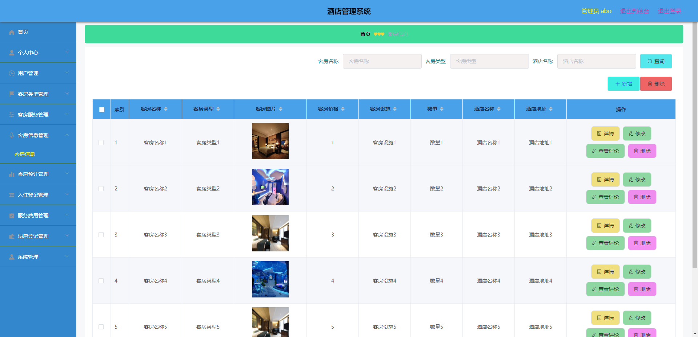
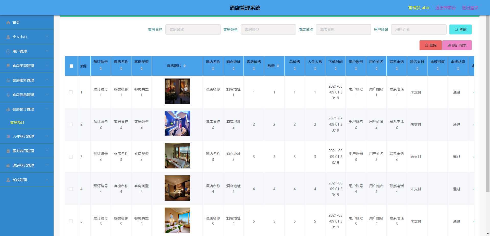
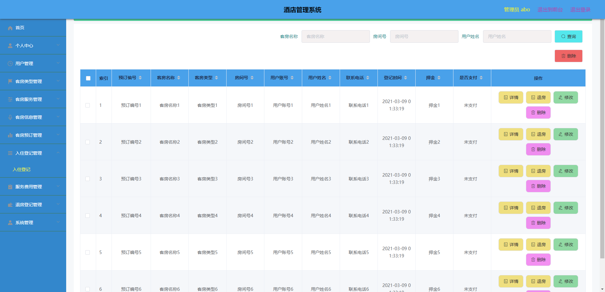
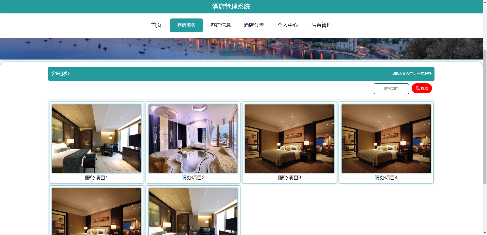
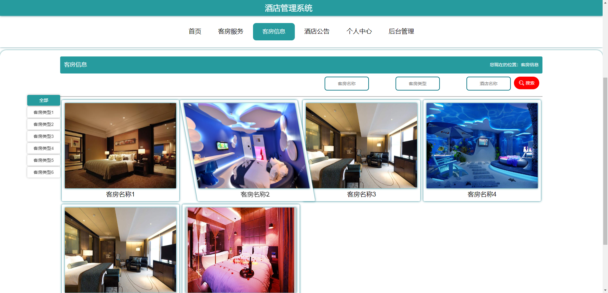
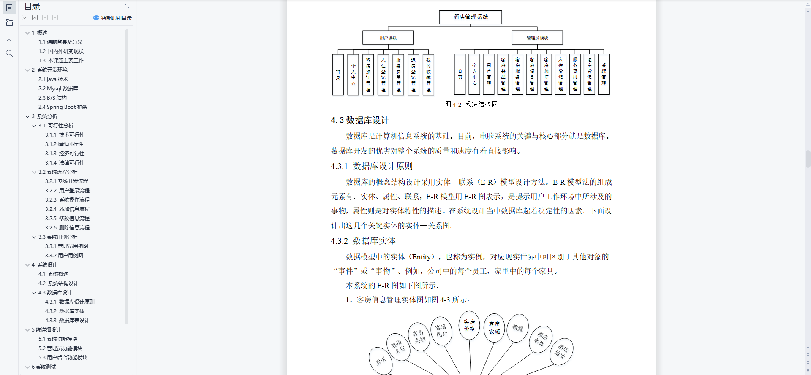
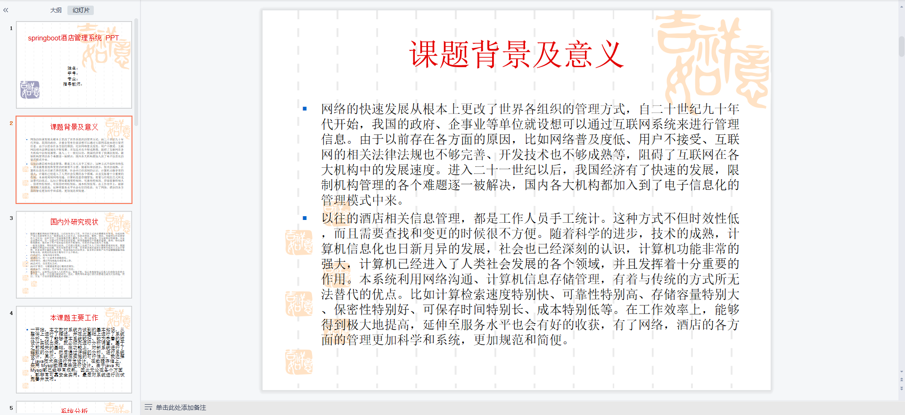
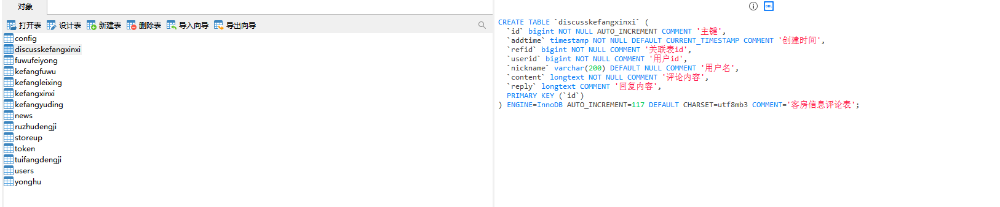

# 1 项目介绍
基于SSM+Vue的水果商城系统：后端 SpringBoot、Mybatis-Plus，前端Vue+ElementUI，具体功能如下：
## 管理端
- 个人中心：查看和修改个人信息
- 用户管理
- 客房类型管理
- 客房服务管理
- 客房信息管理
- 客房预订管理
- 入住登记管理
## 用户端
- 个人中心
- 入住登记管理
- 客房预订管理
- 退房登记管理
- 我的收藏管理
# 2 系统运行截图
## 2.1 用户登录

## 2.2 客房信息管理

## 2.3 客房预订管理

## 2.4 入住登记管理

## 2.5 服务费用管理

## 2.6 客房服务

## 2.7 客房信息

## 2.8 万字论文

## 2.9 PPT

# 3 数据库设计

# 4 源码数据库获取(收费)

